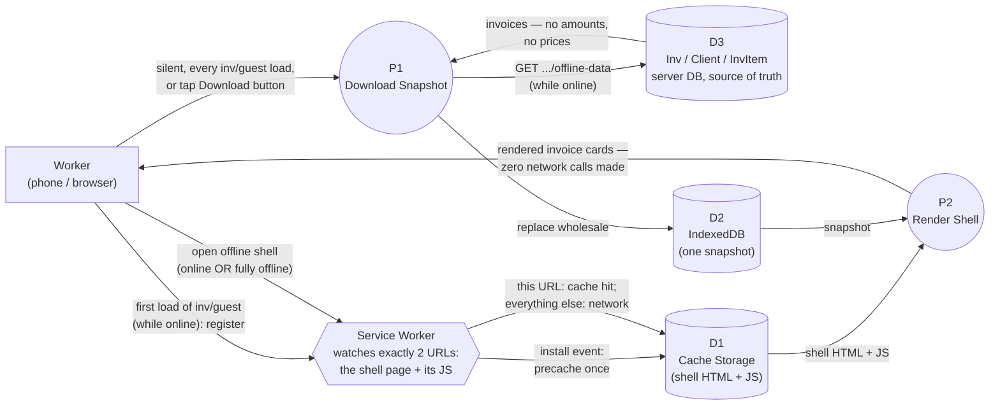

# HomeCare — Offline PWA Data Flow (August 2026)

Companion diagram to the prose design doc,
[`HOMECARE_OFFLINE_PWA_AUGUST_2026.md`](HOMECARE_OFFLINE_PWA_AUGUST_2026.md) —
this is the mechanism behind the "📥 Download for Offline" / "📱 View
Offline Copy" links a worker sees on
[`inv/guest`](HOMECARE_WORKER_ALLOCATION_DATA_FLOW_AUGUST_2026.md), and
what happens once they've tapped one.

> `inv/guest` itself is never cached — it's a live server-rendered page
> with a CSRF token and session state that would go stale the moment a
> service worker served a copy of it. Instead there are two separate
> client-side stores: **Cache Storage** holds a small static shell page
> (precached once), **IndexedDB** holds the actual invoice data (a
> snapshot, replaced wholesale every time the worker has connectivity).
> Offline, the shell always loads and always renders from whatever
> snapshot is already there — no network call either page makes fails
> silently, because neither one makes a network call at all.

## Reading it

- **Two stores, two different jobs.** `D1` (Cache Storage) only ever
  holds the shell's static assets, written once at install time — it's
  what makes the *page itself* loadable with zero connectivity. `D2`
  (IndexedDB) holds the actual data, and is the only thing `P1`/`P2`
  ever touch — it's what makes the *content* current. Confusing the two
  was the actual risk this design avoided: a service worker naively
  caching `inv/guest`'s own HTML would solve neither problem correctly,
  since that page's CSRF token and session state can't be replayed
  later without going stale.
- **`P1` runs far more often than the worker realizes.** The visible
  "Download for Offline" button and the *silent* background re-sync on
  every single `inv/guest` page load both call the exact same path —
  `homecare-offline.ts`'s `downloadForOffline()`. This is the entire
  mechanism behind "the offline copy refreshes itself" — there's no
  separate sync scheduler, just this function running once per page
  view while the worker happens to be online.
- **`SW`'s job is narrow on purpose.** `sw.ts`'s `fetch` handler checks
  the request against exactly two hardcoded URLs
  (`/client_invoices/offline` and `/homecare-offline-shell.js`) and
  passes everything else straight to the network, untouched — including
  `inv/guest` itself. That narrowness is the whole safety property: it's
  structurally impossible for this service worker to ever serve a stale
  copy of a page that carries live session state.
- **`P2` never fails offline, because it never tries the network.**
  `homecare-offline-shell.ts` only reads `D2` — if nothing's been
  downloaded yet, it shows an empty-state message instead of erroring.
  There's no code path in this page that can produce "offline error" in
  the way a normal fetch failure would.

## Out of scope here

Nothing is ever written back to the server from this flow — it's
view-only by design (see the prose doc's own "two scoping decisions").
Also unverified: real airplane-mode behavior on a physical device
(desktop devtools' offline throttle doesn't fully exercise service
worker installability on mobile Safari/Chrome), and the two app icons
are still a placeholder monogram, not a real design.
