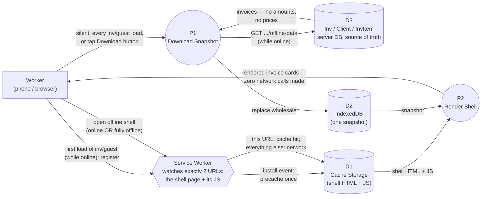

# HomeCare — Offline PWA Data Flow (August 2026)

Companion diagram to the prose design doc,
[`HOMECARE_OFFLINE_PWA_AUGUST_2026.md`](HOMECARE_OFFLINE_PWA_AUGUST_2026.md) —
this is the mechanism behind the "📥 Download for Offline" / "📱 View
Offline Copy" links a worker sees on
[`inv/guest`](HOMECARE_WORKER_ALLOCATION_DATA_FLOW_AUGUST_2026.md), and
what happens once they've tapped one.

> `inv/guest` itself is never cached — it's a live server-rendered page
> with a CSRF token and session state that would go stale the moment a
> service worker served a copy of it. Instead there are two separate
> client-side stores: **Cache Storage** holds a small static shell page
> (precached once), **IndexedDB** holds the actual invoice data (a
> snapshot, replaced wholesale every time the worker has connectivity).
> Offline, the shell always loads and always renders from whatever
> snapshot is already there — no network call either page makes fails
> silently, because neither one makes a network call at all.

## Reading it

- **Two stores, two different jobs.** `D1` (Cache Storage) only ever
  holds the shell's static assets, written once at install time — it's
  what makes the *page itself* loadable with zero connectivity. `D2`
  (IndexedDB) holds the actual data, and is the only thing `P1`/`P2`
  ever touch — it's what makes the *content* current. Confusing the two
  was the actual risk this design avoided: a service worker naively
  caching `inv/guest`'s own HTML would solve neither problem correctly,
  since that page's CSRF token and session state can't be replayed
  later without going stale.
- **`P1` runs far more often than the worker realizes.** The visible
  "Download for Offline" button and the *silent* background re-sync on
  every single `inv/guest` page load both call the exact same path —
  `homecare-offline.ts`'s `downloadForOffline()`. This is the entire
  mechanism behind "the offline copy refreshes itself" — there's no
  separate sync scheduler, just this function running once per page
  view while the worker happens to be online.
- **`SW`'s job is narrow on purpose.** `sw.ts`'s `fetch` handler checks
  the request against exactly two hardcoded URLs
  (`/client_invoices/offline` and `/homecare-offline-shell.js`) and
  passes everything else straight to the network, untouched — including
  `inv/guest` itself. That narrowness is the whole safety property: it's
  structurally impossible for this service worker to ever serve a stale
  copy of a page that carries live session state.
- **`P2` never fails offline, because it never tries the network.**
  `homecare-offline-shell.ts` only reads `D2` — if nothing's been
  downloaded yet, it shows an empty-state message instead of erroring.
  There's no code path in this page that can produce "offline error" in
  the way a normal fetch failure would.

## Fixed since this was first published

- **Install nudge, closing the eviction gap above.** This doc originally
  flagged two compounding gaps: nothing prompted a worker to add the app
  to their home screen, and iOS Safari's Intelligent Tracking Prevention
  deletes script-writable storage — `D1` and `D2` both — after 7 days
  without a visit *unless* it's been added to the home screen, which is
  explicitly exempted
  ([lapcatsoftware.com](https://lapcatsoftware.com/articles/2023/8/5.html),
  [Apple Developer Forums](https://developer.apple.com/forums/thread/710157),
  [iTnews](https://www.itnews.com.au/news/apple-cops-flak-for-deleting-local-browser-storage-after-7-days-539833)).
  A worker who'd bookmarked rather than installed — the likelier
  outcome, since nothing prompted otherwise — could have both stores
  silently wiped after a week off, then open the offline shell to find
  it empty with no explanation why.

  Fixed with `src/typescript/homecare-install-prompt.ts`
  (`initHomeCareInstallPrompt()`, wired into `index.ts`, worker-only
  banner markup in `guest.php`). Two genuinely different paths, since
  iOS Safari never fires `beforeinstallprompt` at all:
  - **Chrome/Edge/Android** — the real event is captured and a
    one-tap "📲 Install app" button calls its own `.prompt()`.
  - **iOS Safari** — no programmatic install trigger exists at all, so
    this is a static "tap Share, then Add to Home Screen" instruction
    instead.

  Both stay hidden if already running installed
  (`display-mode: standalone` / the legacy `navigator.standalone`
  flag), and a dismiss button suppresses the banner for 14 days
  (`localStorage`, fails open — a private-browsing worker with storage
  disabled just sees the banner every visit rather than never being
  able to dismiss it). Verified: 7 new Vitest tests
  (`homecare-install-prompt.test.ts`) covering the standalone check,
  the dismissal window, both browser paths, and the dismiss action
  itself; full project Psalm and Testo still clean.

## Out of scope here

- **No write-back, and nothing built to support it.** View-only is a
  deliberate scoping decision (see the prose doc's own "two scoping
  decisions"), not just an unfinished feature — there's no offline
  mutation queue, no conflict-resolution logic, nothing to reconcile
  when connectivity returns, because nothing is ever staged offline in
  the first place. This is also why flagging `do_not_send`
  ([`HOMECARE_WORKER_ONSITE_ACTIONS_DATA_FLOW_AUGUST_2026.md`](HOMECARE_WORKER_ONSITE_ACTIONS_DATA_FLOW_AUGUST_2026.md))
  still needs a live connection — it's a plain `POST`, and building an
  offline queue for just that one action would be real new machinery,
  not a gap in this one.

- **A failed silent refresh is completely silent.** `downloadForOffline()`
  on the *manual* button path calls `showStatus()` on failure; the
  *silent* background refresh's own call
  (`homecare-offline.ts:downloadForOffline().catch(() => undefined)`)
  swallows the error with no UI signal at all. The only way a worker
  could notice their copy is stale is the `downloadedAt` timestamp
  rendered on the shell page itself (`homecare-offline-shell.ts`) — real,
  but passive: nothing draws their attention to it or warns them it's
  old.

- **No IndexedDB schema migration path.** `openDb()`'s
  `onupgradeneeded` handler only ever creates the object store if it
  doesn't exist yet (`DB_VERSION` has been `1` since this shipped) —
  there's no branch for what happens to an existing snapshot the day
  this schema needs to change. Not a live bug, since nothing has needed
  to change it yet, but worth knowing before that day arrives.

- **Real airplane-mode behavior on a physical device is still
  unverified.** Desktop devtools' offline throttle exercises the
  `fetch` handler's logic, but not full service worker
  installability/registration edge cases on mobile Safari/Chrome — the
  actual target platform. No automated test can close this one — jsdom
  doesn't implement service workers, and there's no real device in CI.
  What `Tests/Testo/Invoice/Inv/OfflinePwaInstallabilityTest.php` does
  instead: guards every *precondition* a real-device check would
  depend on (the manifest's icons actually exist at their declared
  size, `sw.js`'s precache list still matches the real registered
  routes, the JSON data endpoint never gets precached by mistake) —
  catching the class of regression that would make a phone check moot
  before anyone's spent the 10 minutes, and its own class docblock
  says outright that a green run there isn't "verified," it's "still
  outstanding, and here's how to know if this codebase drifted while
  it waits."

- **The two app icons are still a placeholder monogram**, not a real
  design.
