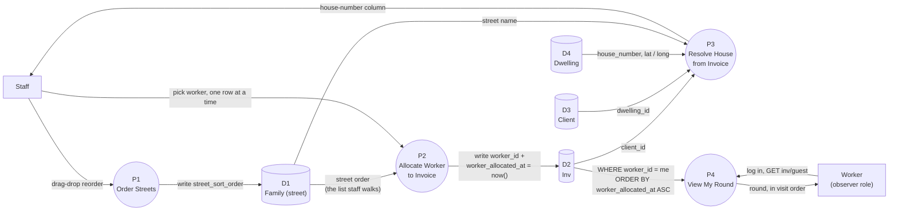

# HomeCare — Worker Allocation & Cleaning Route Data Flow (August 2026)

Scoped to the mechanism built in
[`PRODUCT_TAXONOMY_AND_IMAGES_FOR_WEBSHOP_AUGUST_2026.md`](PRODUCT_TAXONOMY_AND_IMAGES_FOR_WEBSHOP_AUGUST_2026.md)'s
sibling feature work — how a `Worker` ends up with a definitive, ordered
list of houses to clean. Not a full HomeCare data flow: client
signup/`Dwelling` creation, invoice generation itself, and payment are
separate flows, worth their own diagrams later rather than folded into
this one.

> The cleaning order is never directly edited. It's the timestamp order
> staff naturally produce by allocating one worker per invoice, one row
> at a time, down a list that's already sorted by street —
> `worker_allocated_at` just records when that happened.

## Reading it

- **`D1`'s only consumer that matters here is `P2`.** `street_sort_order`
  (set via `family-street-order.ts`'s drag-and-drop, `family/street_order.php`)
  exists to control the order Staff *sees* invoices in on `inv/index`
  while allocating — nothing downstream reads it directly. It works on
  the worker's route only indirectly, by shaping the order `P2`'s writes
  happen in.
- **`P2`'s write is the one this whole feature turned on.**
  `Index::setWorker()` sets `worker_id` **and** stamps
  `worker_allocated_at = now()` in the same call — re-stamped on every
  reassignment, cleared back to `null` on unassignment. No separate
  "cleaning order" field exists; this timestamp *is* the order.
- **`P4`'s query is the payoff.** `InvRepository::repoWorkerVisible()`
  sorts by `worker_allocated_at` ascending instead of the app-wide
  `id desc` default — earliest-allocated first. As long as Staff worked
  down a street-ordered list in `P2`, the timestamps `P4` sorts by
  already follow the route, with no separate sequence number for anyone
  to keep in sync by hand.
- **`P3` is read-only plumbing, not part of the ordering mechanism.**
  It's the existing `Inv → Client → Dwelling → Family` chain
  (`InvsDwellingHouseNumberColumnTrait`) that turns an invoice into a
  displayable address — included here because both `P2` (Staff, via the
  house-number column next to the worker-assignment dropdown) and
  implicitly `P4` (Worker, via the same chain rendered on their own
  `inv/guest` rows) depend on it, even though it doesn't write anything.

## Out of scope here

Where `D3`/`D4` rows themselves come from (client signup, dwelling
creation/geocoding), invoice generation (`P1`'s missing upstream
neighbor), and what a Worker does once they're looking at a house
(marking a job done, flagging `do_not_send` on an on-site problem) —
each is a real, separate data flow worth its own diagram.
