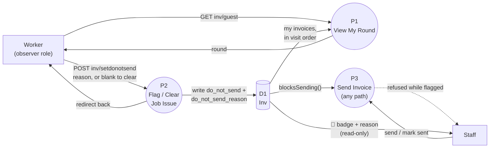

# HomeCare — Worker On-Site Actions Data Flow (August 2026)

Sequel to
[`HOMECARE_WORKER_ALLOCATION_DATA_FLOW_AUGUST_2026.md`](HOMECARE_WORKER_ALLOCATION_DATA_FLOW_AUGUST_2026.md),
picking up where that one left off: the Worker already has their round,
in order. This is what they can actually *do* once they're standing at a
house.

> A worker's only write action from `inv/guest` is a single flag —
> `do_not_send` — and clearing it is the exact same action submitted
> with a blank reason. That one field is the whole mechanism that keeps
> a problem invoice from going out while staff sort it out; there's no
> separate "mark complete," no payment action, no status change a
> worker can make at all.

## Reading it

- **`P2` is gated by `VIEW_INV`, not `EDIT_INV`.** That's deliberate,
  not an oversight — the worker RBAC role only has `VIEW_INV`
  (`resources/rbac/items.php`), so `Guest::setDoNotSend()` had to sit
  behind that same permission to be reachable at all, even though it's
  a write. It's the one exception to "worker can only look."
- **The reason is a closed set, not free text** —
  `App\Invoice\Enum\DoNotSendReason`: property inaccessible, job
  incomplete, customer dispute, damage occurred, safety concern, other.
  A worker picks one to flag; submitting no reason is how they clear it.
  Same route, same action, both directions.
- **`P3` isn't one code path — it's every way an invoice could get
  sent.** `Inv::blocksSending()` (just `return $this->do_not_send;`) is
  checked at the actual status-to-"sent" transition
  (`InvService`), a single email send (`Email.php`), batch email
  (`InvBatchEmailService`), and an auto-mark-sent Setting. Wherever
  Staff (or an automated run) tries to send, the same flag stops it —
  drawn here as one node because that's the actual shape of the
  guarantee: it doesn't matter which path Staff takes, a flagged
  invoice cannot go out.
- **Staff's view of the flag is read-only.** `InvsDoNotSendColumnTrait`
  on `inv/index` shows the 🚫 badge and reason as a tooltip; the
  trait's own docblock is explicit that "a manager never edits it from
  here" — clearing it is still the worker's action from `inv/guest`,
  the same `P2`.

## Out of scope here

`P2` is a plain online `POST` — no offline queue. The existing
[offline PWA](HOMECARE_OFFLINE_PWA_AUGUST_2026.md) only ever snapshots a
worker's round for zero-connectivity *viewing*; flagging a problem
still needs a live connection. Also not built at all: any worker action
for "job done" (no completion status, no GPS capture) — the worker's
entire write surface today is this one flag.
